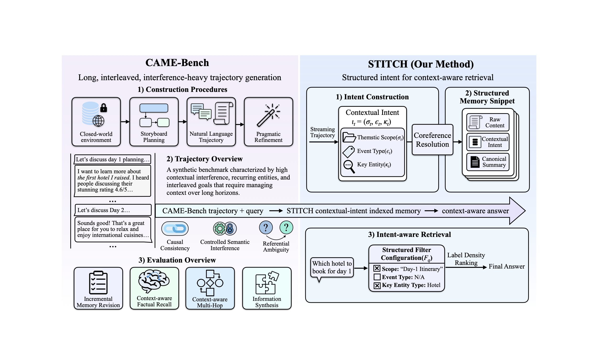

# Grounding Agent Memory in Contextual Intent

[](https://arxiv.org/abs/2601.10702) [](https://contextual-intent.github.io) [](https://huggingface.co/datasets/Seattleyrz/CAME-Bench)

<div align="center">



</div>

This repository contains **STITCH** (Structured Intent Tracking in Contextual History), a novel memory system for agents, and **CAME-Bench**, a comprehensive benchmark for evaluating agent memory consolidation.

🌐 **Visit our [project website](https://contextual-intent.github.io) for interactive demos, detailed methodology, and the benchmark explorer. Read the full paper [here](https://arxiv.org/abs/2601.10702). Dataset is available on [Hugging Face](https://huggingface.co/datasets/Seattleyrz/CAME-Bench).**

## 🛠️ Installation

Start by setting up the environment. We recommend using a virtual environment:

```bash
# 1. Create and activate environment
python3 -m venv .venv
source .venv/bin/activate

# 2. Install dependencies
pip install -r requirements.txt
```

## 🚀 Quick Start

Select the relevant guide below based on your objective:

### 1. Benchmark Custom Methods on CAME-Bench
To evaluate a new retrieval or memory method using our dataset and metrics, check out the example script:

```bash
# Configure your API key first (e.g. OpenAI)
export OPENAI_API_KEY="sk-..."

# Run the example benchmark script
python example_run_benchmark.py
```

For detailed documentation:
👉 **[Read the Benchmark Usage Guide](doc/README_CAME_BENCH_USAGE.md)**

### 2. Run STITCH on New Datasets
To apply the STITCH memory system to external logs or other benchmarks:
👉 **[Read the STITCH Usage Guide](doc/README_STITCH_USAGE.md)**

### 3. Replicate Paper Results
To reproduce the experimental results for STITCH on CAME-Bench and LongMemEval as reported in the paper:
👉 **Switch to the `paper-exp` branch**
```bash
git checkout paper-exp
```

### 4. Replicate Dataset Construction
To generate the CAME-Bench dataset from scratch (including debate trajectories and travel plans):
👉 **Switch to the `CAME-Bench_construction` branch**
```bash
git checkout CAME-Bench_construction
```

---

## 🗂️ Repository Structure

| Path | Description |
| --- | --- |
| `came_bench/` | The core benchmark library, including data loading, pipeline, and evaluation logic. |
| `method_stitch/` | Core implementation of the STITCH memory system. |
| `proto/` | Protocol Buffer definitions for data structures and configurations. |
| `scripts/` | Utility scripts. |
| `doc/` | Documentation and usage guides. |

## 📄 Citation

```bibtex
@misc{yang2026groundingagentmemorycontextual,
      title={Grounding Agent Memory in Contextual Intent}, 
      author={Ruozhen Yang and Yucheng Jiang and Yueqi Jiang and Priyanka Kargupta and Yunyi Zhang and Jiawei Han},
      year={2026},
      eprint={2601.10702},
      archivePrefix={arXiv},
      primaryClass={cs.CL},
      url={https://arxiv.org/abs/2601.10702}, 
}
```
